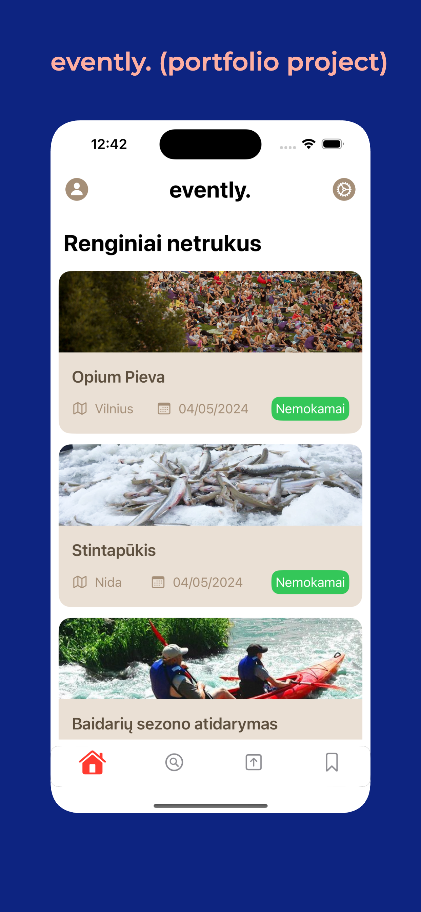
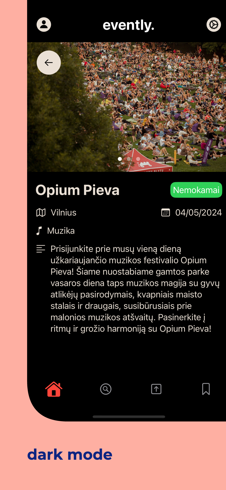
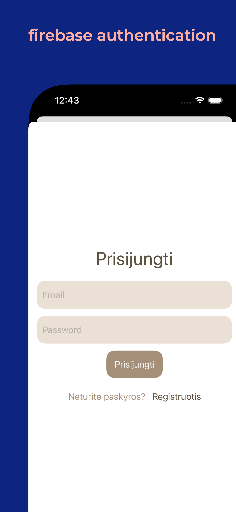
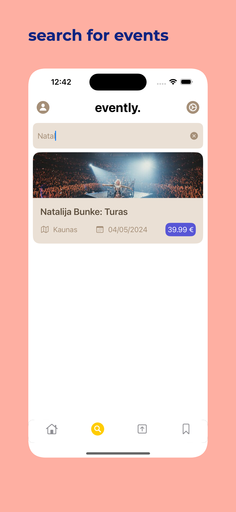
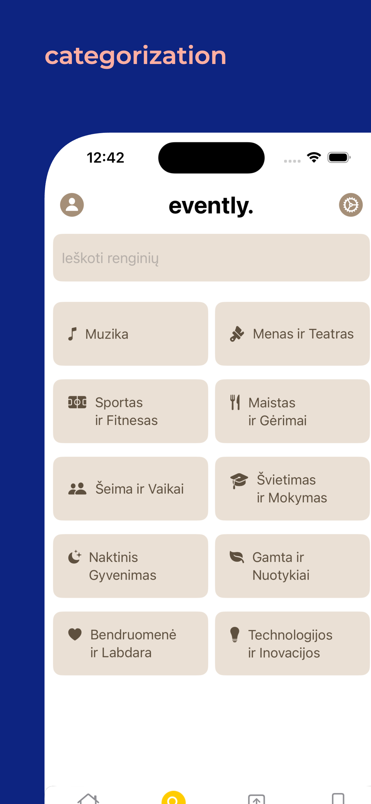

# evently. - local event lookup
My first personal project that turned out to be in a portfolio.
*The app does not contain actual event fetching and is fitted with **fake data**.*

## Features
- Firebase authentication
- Searching
- Details for events
- Dark/Light modes with easy to change color schemes

*Project is used for design showcase and firebase integration*

  
  
  
  
  

